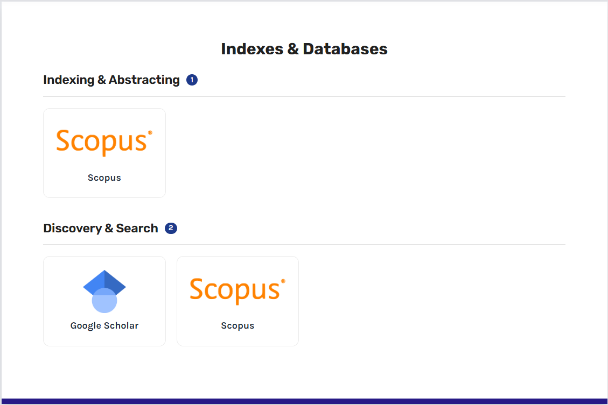
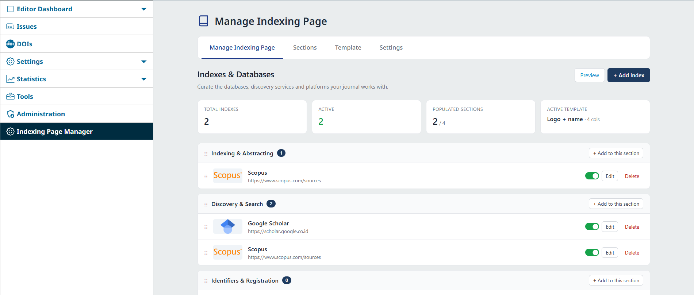
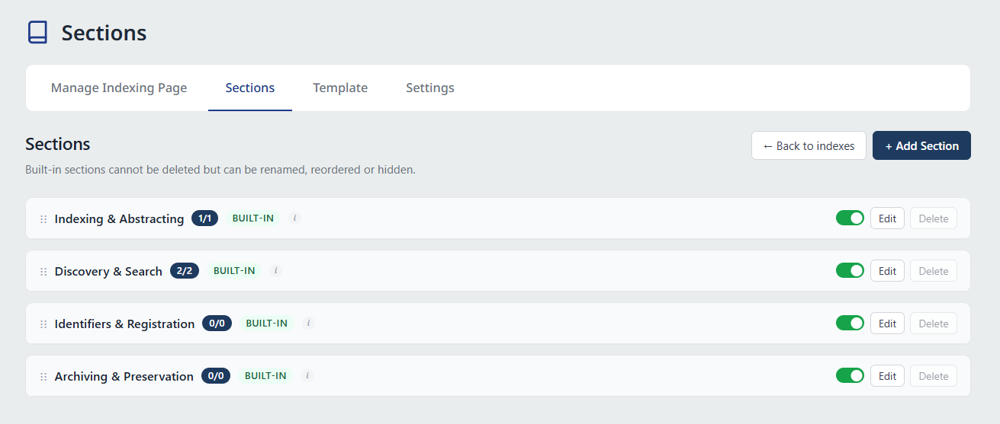
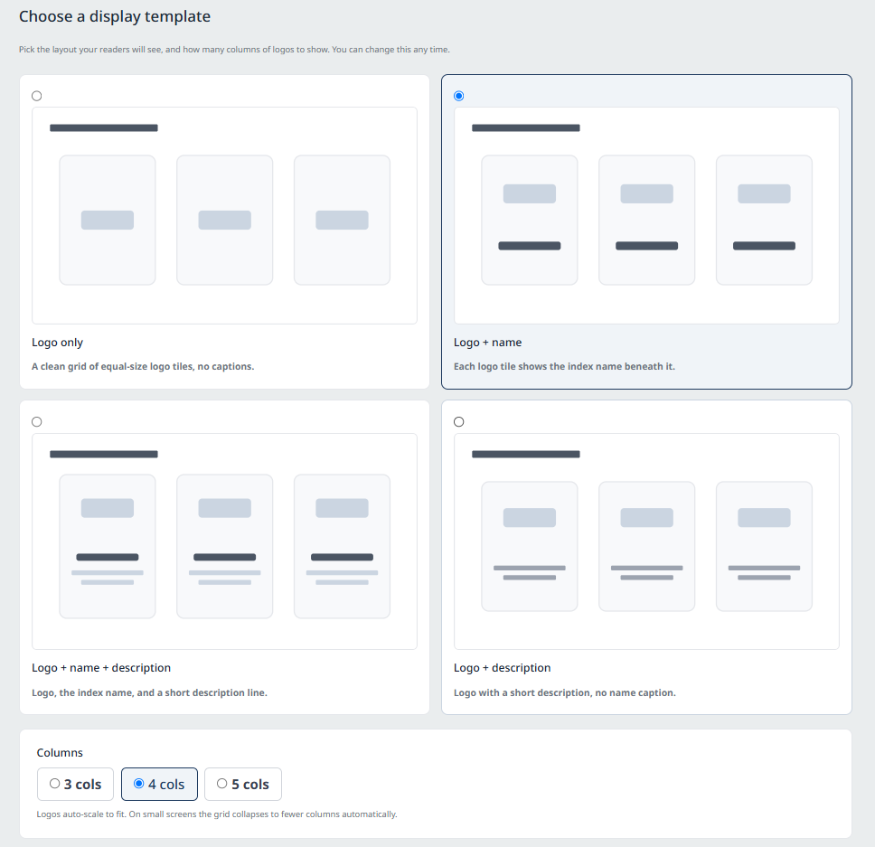
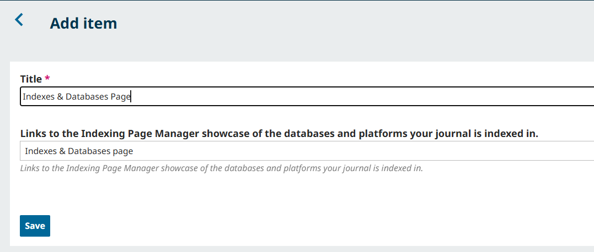

# Indexing Page Manager

A **free** OJS 3.4 / 3.5 plugin that lets your journal display the databases, indexes and services it is listed in — Scopus, Web of Science, DOAJ, TR Dizin, PubMed, Crossref and more — as a clean, professional **logo gallery**.

Everything is managed from your journal's admin panel. **No coding knowledge required.**

---

## Screenshots

**The public page your readers see**

**Manage your indexes from the admin panel** — add, edit, reorder (drag & drop) and show/hide.

**Four ready-made categories**, plus any custom sections you add.

**Pick a layout and column count** — change it any time.

**A ready-made menu item** lets you add the page to your site menu in one step.

---

## Features

- **A logo gallery of your indexes** — add each one with its logo, name, a short description and a link.
- **Four ready-made categories** — *Indexing & Abstracting, Discovery & Search, Identifiers & Registration, Archiving & Preservation* — plus your own custom sections.
- **Managed entirely from the admin panel** — add, edit, show/hide and reorder by drag-and-drop. No coding knowledge required.
- **Layout choices** — four display styles (logos only / logo + name / logo + name + description / logo + description) and 3, 4 or 5 columns.
- **Fits your theme** — looks at home in any OJS theme, with a centred page title and a mobile-friendly layout.
- **A ready public page** — at `/<journal>/indexes-and-databases`, which you can add to your menu with one click using the built-in menu item.
- **Multilingual** — ships with English and Turkish, and works on multilingual journals.
- **Search-engine friendly** — adds structured data so search engines understand where your journal is indexed.

## Requirements

- OJS **3.4.0.x** or **3.5.0.x**
- PHP **8.0 – 8.3** (OJS 3.4 needs PHP 8.0+; OJS 3.5 needs PHP 8.2+ — use whichever your OJS install requires)
- MySQL / MariaDB
- Works on single- and multi-journal installations

## Installation

**From the journal (recommended):** *Settings → Website → Plugins → Upload a New Plugin* → select the `.tar.gz` → **Enable**.

**Manually:** unzip into `plugins/generic/indexingPageManager`, then enable it under *Plugins*.

## Usage

After enabling, an **Indexing Page Manager** entry appears in your admin sidebar. Add your indexes and arrange them there.

Your public page is available at `https://your-site/index.php/<journal>/indexes-and-databases`. The older addresses `…/ipmShowcase`, `…/gateway/plugin/ipmShowcase` and `…/about/databases` still work as fallbacks. To put the page in your site navigation, go to *Settings → Website → Setup → Navigation Menus → Add Item* and choose the ready-made **“Indexes & Databases page”** item — no manual link needed.

## Works with every theme

The plugin works on **any OJS 3.4 or 3.5 theme**. It was designed alongside our **Atlas** theme, where your index logos can also appear as a block on the journal homepage. See our themes: [litpam.com](https://litpam.com)

Theme authors can embed the gallery anywhere with the `{ipm_blocks}` template function.

## License

Free and open-source under the **GNU GPL v2**.

## Developed by

**Litpam** — [litpam.com](https://litpam.com) · info@litpam.com
